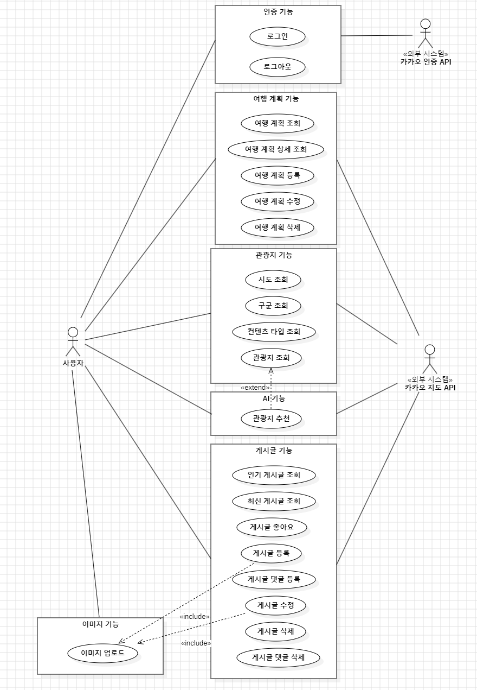
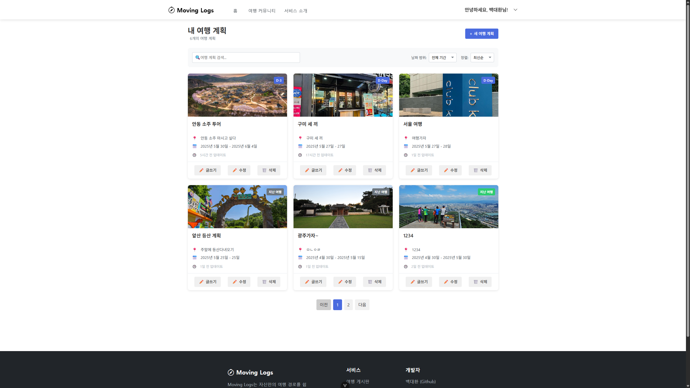

# MovingLogs
관광지 데이터를 기반으로 여행 계획을 관리하고 여행 게시판으로 여행 계획을 세우고, 여행 커뮤니티를 통해 여행 계획을 공유할 수 있는 플랫폼입니다.

## 상세 내용
### 헥사고날 아키텍처 적용
전통적인 MVC 아키텍처를 벗어나 헥사고날 아키텍처를 적용시켜 외부 종속성에 대한 결합도를 낮춰 유지보수성이 높은 시스템을 개발하였습니다.

외부 종속성이 필요한 부분을 인터페이스로 식별하고 외부 기술에 종속된 코드는 해당 인터페이스를 구현하는 구현체에만 넣도록 하여 기술이 바뀌었을 때의 유지보수성을 향상시켰습니다.

#### 적용 예시 ####
ChatGPT API를 이용한 AI 기능을 제공하는 AiService 코드입니다. 해당 코드에서 ChatGPT와 관련된 종속 코드를 넣지 않고 외부 시스템을 이용한다는 의미에서 외부 Port를 선언하여 레퍼런스를 지니고 있습니다. 구현체는 Spring Container에 의해 DI 됩니다.
```java
//AiService
@Service
@RequiredArgsConstructor
public class AiService implements AttractionRecommendationUseCase {
    //RecommendAttractionPort가 바로 외부와 연결되는 포트입니다.
    private final RecommendAttractionPort recommendAttractionPort;
    //이하 생략
```

RecommendAttractionPort를 구현하는 ChatGptAdapter를 구현하고, 어댑터 클래스에만 ChatGpt에 종속적인 코드를 작성합니다.

```java
//ChatGptAdapter
@Component
@RequiredArgsConstructor
public class ChatGptAdapter implements RecommendAttractionPort {
    private final ChatClient simpleChatClient;

    @Override
    public AttractionRecommendation attractionRecommend(String userInput) {
        return simpleChatClient.prompt()
                .user(userInput)
                .call()
                .entity(new ParameterizedTypeReference<>() {});
    }
}
```

만일 추후 요구사항이 변경되어 ChatGpt가 아닌 다른 AI API를 사용하게 되었을 때 서비스 레벨의 코드는 바뀔 필요가 없습니다. 다른 API를 사용하는 어댑터만 구현하면 됩니다.

이와 같이 헥사고날 아키텍처를 이용하여 외부 종속 기술에 대한 결합도를 크게 낮출 수 있었습니다.

헥사고날 아키텍처는 모든 종속성의 방향이 도메인 객체로 향하기 때문에 만일 도메인 객체의 요구사항이 바뀔 경우에는 상당히 많은 양의 코드 수정이 필요했습니다.  따라서 헥사고날 아키텍처를 적용시키기 위해서는 요구사항 분석과 도메인 모델에 대한 설계를 최대한 완벽히 해둔 후 적용시켜야 개발 측면에서 이점을 얻을 수 있겠다는 점을 느꼈습니다. 

### 시큐리티 기능 개발
Spring Security + JWT + OAuth를 사용하여 시큐리티 기능을 개발했습니다. 리프레시 토큰은 Redis에 저장하였으며 액세스 토큰을 발급할 때 리프레시 토큰도 같이 재발급합니다.

사용자 인증이 성공할 경우 서버에서 액세스 토큰과 리프레시 토큰을 생성하며, 클라이언트에게는 액세스 토큰만 전달하고 리프레시 토큰은 Token Store(현재는 Redis)에 저장합니다.

만일 사용자의 액세스 토큰이 만료되었다면 액세스 토큰을 기반으로 리프레시 토큰을 Token Store에서 찾고 찾은 리프레시 토큰이 존재한다면 액세스 토큰과 리프레시 토큰을 재발급한 후 액세스 토큰을 다시 사용자에게 전달합니다.


아래는 위 로직이 담겨있는 JWTVerificationFilter의 로직 부분입니다.
```java
@Override
    protected void doFilterInternal(HttpServletRequest request, HttpServletResponse response, FilterChain filterChain) throws ServletException, IOException {
        String token = null;
        try {
            //토큰을 추출해보고
            token = WebUtils.extractToken(request);
            if (token != null) {
                //토큰이 있고, 유효하다면 유저 정보를 context holder에 저장
                Map<String, Object> claims = jwtTokenProvider.getClaims(token);
                saveUserDetailsToSecurityContextHolder(claims.get("uid").toString());
            }
        } catch (ExpiredJwtException e) {
            //액세스 토큰이 만료되었다면
            //리프레시 토큰을 확인해봄
            Optional<String> refreshToken = searchRefreshTokenPort.searchRefreshToken(token);
            if (refreshToken.isPresent()) {
                logger.debug("토큰 재발급");
                //리프레시 토큰이 만료되지 않았다면 둘 다 재발급
                Map<String, Object> claims = jwtTokenProvider.getClaims(refreshToken.get());
                String uid = (String) claims.get("uid");
                User user = searchUserPort.searchUserByUid(new Uid(uid))
                        .orElseThrow(() -> new UserNotFoundException("uid에 대응하는 유저가 없습니다."));
                String accessToken = jwtTokenProvider.createAccessToken(user);
                String newRefreshToken = jwtTokenProvider.createRefreshToken(user);

                //레디스에 리프레시 토큰 저장, 컨텍스트 홀더에 유저 디테일 저장, 액세스 토큰 응답으로 전송
                saveRefreshTokenPort.saveRefreshToken(accessToken, newRefreshToken);
                saveUserDetailsToSecurityContextHolder(uid);

                /*
                이 시점에서는 클라이언트의 API가 axios로 요청된 경우.
                로그인 버튼을 눌렀을 때는 axios가 아니라 windows.loaction을 직접 바꿔서 접근하기 때문에
                리다이렉트로 토큰을 수신할 수 있지만
                axios는 redirect 요청을 정상적으로 받지 않으므로 다른 방법으로 요청해야함
                따라서 액세스 토큰을 JSON의 형태로 담아 클라이언트로 보내고
                axios의 인터셉터를 이용하여 응답에 액세스 토큰이 있다면 토큰을 클라이언트측에 저장하고
                다시 재요청을 보내도록 구현
                또한 여기서 값이 반환되므로 현재 들어온 요청이 이 필터를 통과하면 안됨
                따라서 doFilter 하지 않고 그대로 반환
                 */
                jwtUtils.responseWithJwtToken(response, accessToken, user.getName());
                return;
            }
        }

        filterChain.doFilter(request, response);
    }
```

OAuth2의 경우 Kakao를 사용하였으며 Spring의 Oauth2 Client를 사용하였습니다. 

```java
//SecurityConfig.java
        .oauth2Login(oauth2 -> oauth2
        .userInfoEndpoint(userInfo -> userInfo
        .userService(defaultOAuth2UserService))
        .successHandler(simpleUrlAuthenticationSuccessHandler)
        );
        return http.build();
```

```java
//defaultOAuth2UserService
@Component
@RequiredArgsConstructor
public class KakaoOAuthAdapter extends DefaultOAuth2UserService {
    private final CreateOAuth2UserUseCase createOAuth2UserUseCase;

    @Override
    public OAuth2User loadUser(OAuth2UserRequest userRequest) throws OAuth2AuthenticationException {
        //카카오로부터 인증 정보를 수신
        OAuth2User oAuth2User = super.loadUser(userRequest);

        //정보 추출
        Map<String, Object> attributes = oAuth2User.getAttributes();
        String kakaoId = attributes.get("id").toString();
        String name = ((LinkedHashMap<?, ?>) attributes.get("properties")).get("nickname").toString();
        //서비스 호출(현재 우리 DB에 없는 사용자라면 저장)
        createOAuth2UserUseCase.createOAuth2User(KakaoOAuthMapper.toCreateOAuth2UserUseCaseCommand(kakaoId, name));
        return oAuth2User;
    }
}
```
```java
//simpleUrlAuthenticationSuccessHandler
@Component
@RequiredArgsConstructor
public class OAuth2LoginSuccessHandler extends SimpleUrlAuthenticationSuccessHandler {
    private final JwtTokenProvider jwtTokenProvider;
    private final SearchUserPort searchUserPort;
    private final SaveRefreshTokenPort saveRefreshTokenPort;
    private final JwtUtils jwtUtils;

    @Override
    public void onAuthenticationSuccess(HttpServletRequest request, HttpServletResponse response, Authentication authentication) throws IOException, ServletException {
        //User를 가져오고
        OAuth2User oAuth2User = (OAuth2User) authentication.getPrincipal();
        User user = searchUserPort.searchUser(String.valueOf((Long) oAuth2User.getAttribute("id")))
                .orElseThrow(() -> new UserNotFoundException("OAuth2User의 id에 대응하는 유저가 없습니다."));

        //액세스 토큰과 리프레시 토큰을 생성
        String accessToken = jwtTokenProvider.createAccessToken(user);
        String refreshToken = jwtTokenProvider.createRefreshToken(user);
        //리프레시 토큰은 Token Store에 저장
        saveRefreshTokenPort.saveRefreshToken(accessToken, refreshToken);
        //액세스 토큰을 포함하여 리다이렉트
        jwtUtils.redirectWithJwtToken(response, accessToken, user.getName());
    }
}
```


### Redis를 활용한 배치 업데이트
게시판 기능 중 '조회수'와 '좋아요'의 경우 업데이트가 발생할 때마다 UPDATE 쿼리를 날리게 되면 추후 트래픽이 몰리는 상황에서 DB에 큰 부하가 가해질 수 있다고 생각했습니다.

따라서 좋아요와 조회수 정보를 Redis에 저장한 후 주기적으로 Bulk Update 하도록 구현하였습니다.

```java
@Component
@EnableScheduling
@RequiredArgsConstructor
public class TripostScheduler {
    private final SyncTripostViewCountFromCacheUseCase syncViewCount;
    private final TripostLikeUseCase tripostLikeUseCase;

    @Scheduled(cron = "0 0 * * * *")
    public void syncCount() {
        syncViewCount.syncViewCount();
        tripostLikeUseCase.syncLiked();
    }
}
```

CRON을 이용하여 Spring의 스케쥴러를 이용하여 1시간마다 조회수와 좋아요를 실제 DB와 동기화합니다.

## 개발인원
| 이름  | 역할                        |
|-----|---------------------------|
| 백대환 | 이미지, 게시판 기능 구현, 기타 인프라 세팅 |
| 한성민 | AI, 관광지, 시큐리티, 여행계획 기능 구현 |

## 배치 다이어그램


## 요구사항 정의서(Usecase Diagram)


## 테이블 구조도(ERD)


## 화면 시안

### 메인화면


### 서비스 소개


### 여행계획


### 여행계획관리



### 여행 게시글


### 게시글 작성


### 게시글 수정


