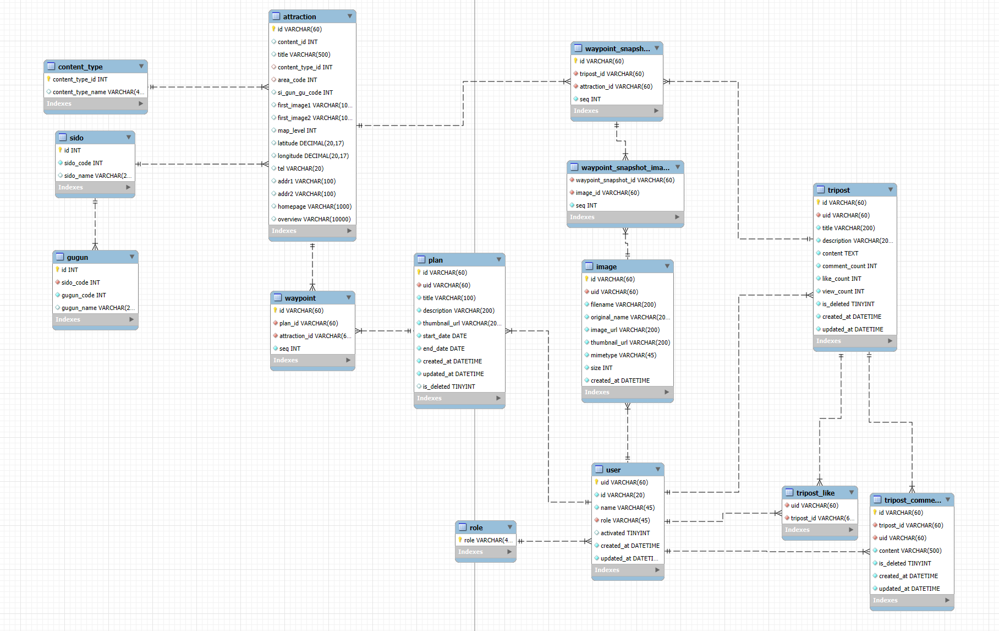
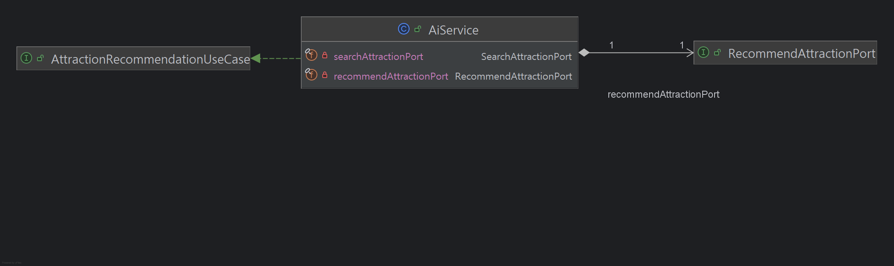
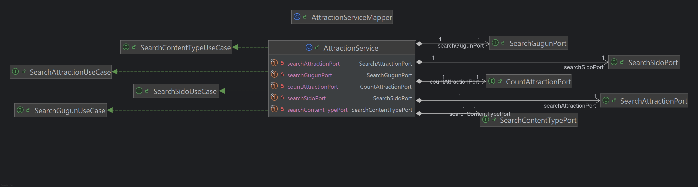
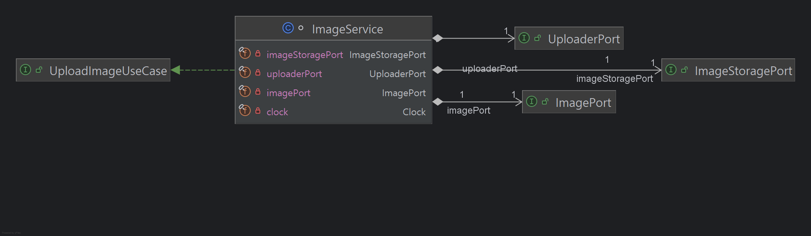
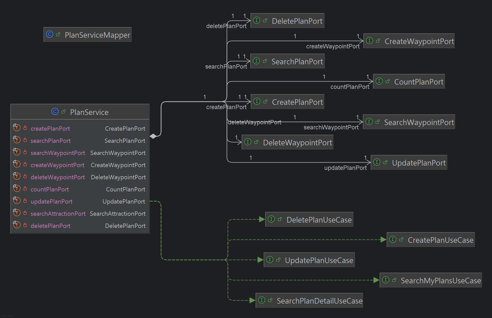
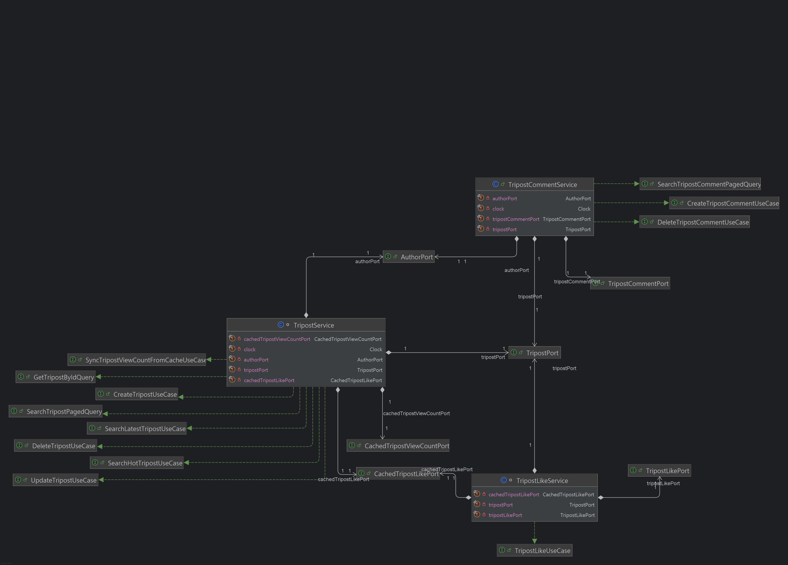
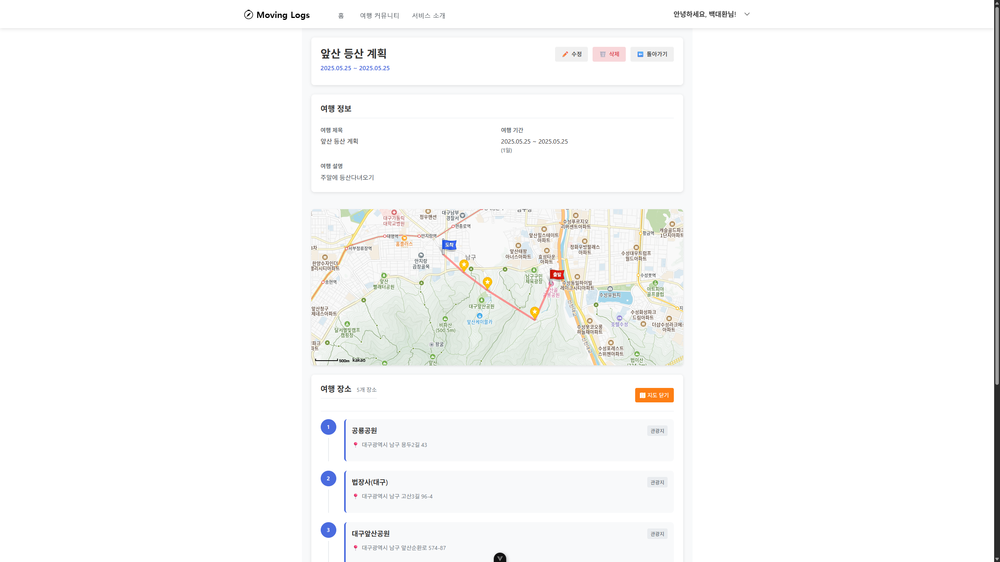

# EnjoyTrip_Final_구미3반_백대환_한성민

## 배치 다이어그램

## 요구사항 정의서(Usecase Diagram)

## 테이블 구조도(ERD)

## 클래스 다이어그램
### AI

### 관광지

### 인증

### 이미지

### 여행 계획

### 게시글

### 게시글 도메인

## 화면 시안

### 메인화면

### 서비스 소개

### 여행계획

### 여행계획관리

### 여행 게시글

### 게시글 작성

### 게시글 수정

